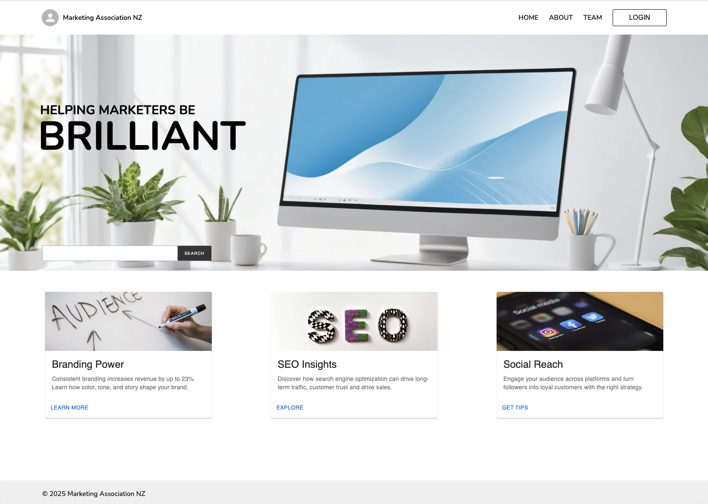

# Mission 0 – Marketing Association NZ Prototype

Welcome to **Mission 0**   
This project is a modern web application built with **Vite**, **React**, and **Material-UI**, designed as a prototype template for the **Marketing Association of New Zealand's** digital homepage.

---

## 🧭 Project Overview

This single-page application serves as a responsive, modern homepage for a digital news platform.  
It reflects the wireframe provided by the client and is built using a current industry tech stack.  
It includes a hero section, card-based content, and mobile responsiveness — without backend or search functionality.

> ⚠️ The search bar is part of the layout only and is not functional.

---
## 📸 Screenshots 

Desktop Homepage

Mobile Homepage <br>


---

## 🧩 Features

- ⚛️ Built with React 19 and Vite for lightning-fast performance
- 🎨 Styled using Material-UI and modular CSS
- 📱 Fully mobile responsive
- ✅ Structured to support future integration with backend APIs

---

## 📋 Prerequisites

- [Node.js](https://nodejs.org/) (v18+ recommended)
- npm or yarn

---

## 🚀 Getting Started

```bash
# 1. Clone the repository
git clone https://github.com/robwynyard/L5-Mission-0.git
cd L5-Mission-0

# 2. Install dependencies
npm install

# 3. Start development server
npm run dev

# 4. Build for production
npm run build
```
---
## 📁 Project Structure

```
mission-0/
├── .git/                # Git repository files
├── .gitignore           # Git ignore file
├── eslint.config.js     # ESLint configuration
├── index.html          # Main HTML file
├── node_modules/       # Project dependencies
├── package.json        # Project configuration
├── package-lock.json   # Dependency versions
├── public/            # Static assets
├── src/               # Source code directory
│   ├── components/    # React components
│   │   ├── CardSection.jsx      # Card-based content section
│   │   ├── CardSection.module.css # Card section styles
│   │   ├── Footer.jsx           # Footer component
│   │   ├── HeroSection.jsx      # Hero banner section
│   │   ├── HeroSection.module.css # Hero section styles
│   │   ├── Home.jsx            # Home page component
│   │   ├── Home.module.css     # Home page styles
│   │   ├── NavBar.jsx          # Navigation bar component
│   │   └── NavBar.module.css   # Navigation bar styles
│   ├── pages/         # Page components
│   ├── styles/        # CSS/SCSS styles
│   ├── utils/         # Utility functions
│   ├── App.jsx        # Main application component
│   └── main.jsx       # Entry point
└── vite.config.js     # Vite configuration
```
